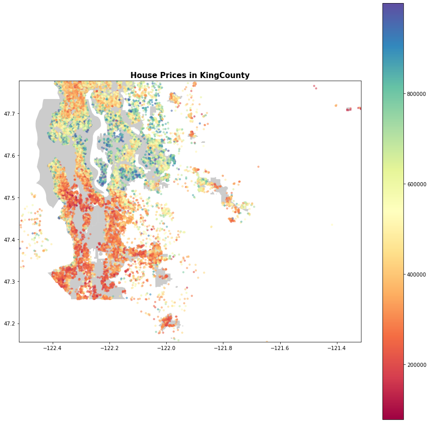
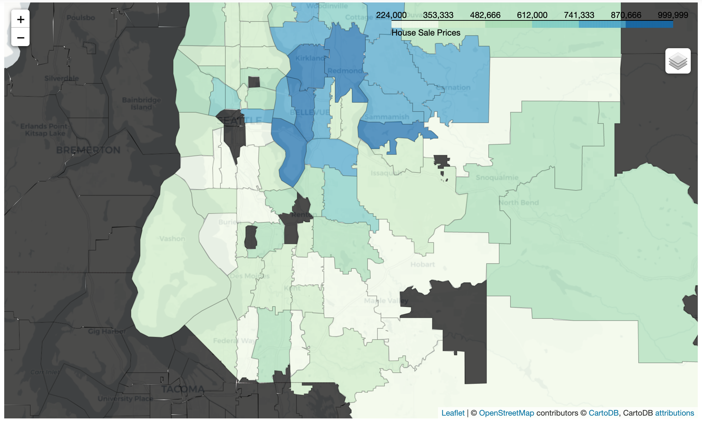
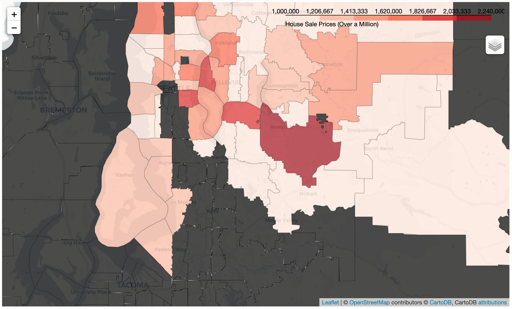
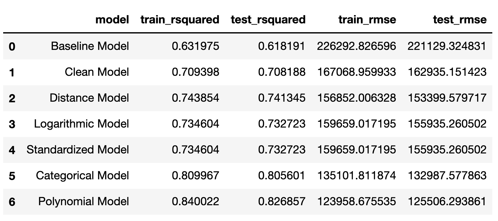
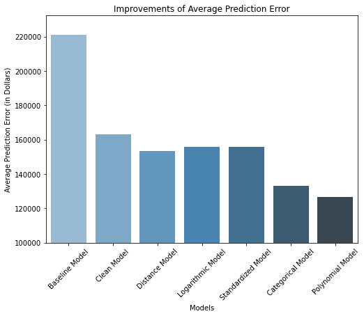
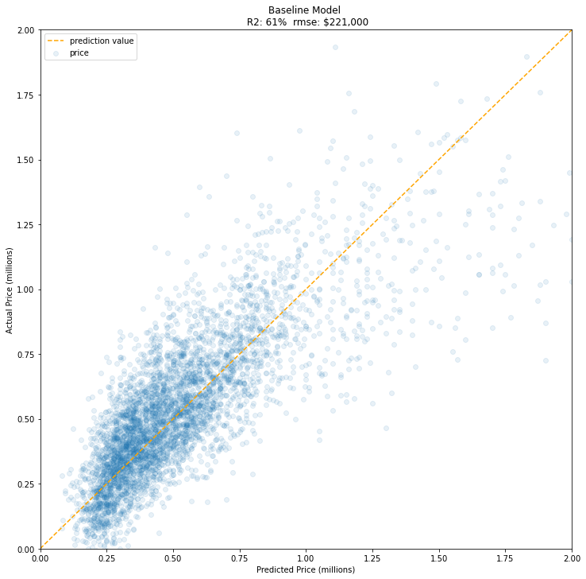
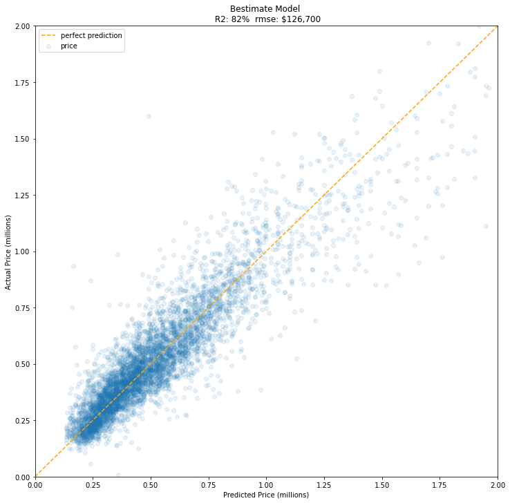
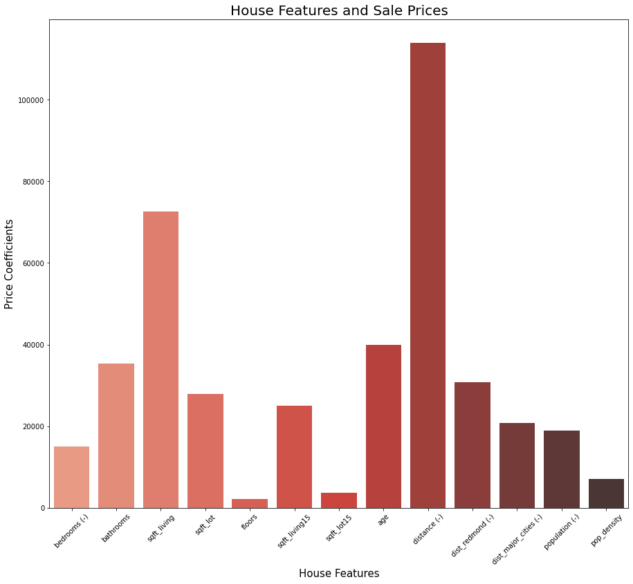

# King County Housing
#### House Price Estimate

**Authors:** Hatice Kastan, Czarina Luna, Ross McKim, Weston Shuken

##### January 2022

***


## Overview
This project analyzes the King County Housing Data from May 2014 to May 2015. This data includes houses sold in the county during that time as well as describing characteristics of these houses, e.g. sale price, sqaure footage, and location.

## Stakeholder
A real estate agency in King County who is looking for help bettering their price prediction model and who wants more quantitative information about what influences sales price.

## Business proposal
Use multiple regression to develop a better model of predicting housing prices in the region. We are also offering inferential information to better advise clients on when to sell or whether it is worthwhile to make changes to their house before selling and for them to get an estimated selling price or an idea of how much the house of their dreams costs.

## Data & Methods
As mentioned, we used the King County Housing Data from 2014-2015 which contains 21,000 data points of house sales. 

We needed to do extensive cleaning of the data and we also created our own features like distance from major cities, appended population data from the 2010 census, and scaled the numeric data. 

In our analysis, we also studied correlations of predictors thorugh visualizations and heat maps, as well as developed multiple regression models to understand the effects on sales price. The train-test split was used throughout to train our model and the test was then used to determine the effectiveness of that training.

## Location Metrics
One key finding of our data exploration was the significance of price of sale given location of the house. The baseline model the does not include loaction features. Later you can see how we implement these features in our model to improve prediction performance.

First, take a look below at a few maps to better understand how sale price is by location in King County: 


*This map show all house sales by longitude and latitude, color coordinated by price*



*This map show avereage house sales by zipcode for homes under 1 million dollars*



*This map show avereage house sales by zipcode for homes over 1 million dollars*




## Modeling Results
Our methods have improved the ability to predict the predicted price of a house. This is shown in improved RMSE (in $) and in R-Squared (in %). 

### Improvement of Models

See the table of how our train and test performed throughout improving our models.


See the graph of how our train and test performed throughout improving our models.


### Bestimate Model

In our final model, called the **Bestimate**, we can see how the predictions have less error compared to the **Baseline** model in the scatter plots below:





The yellow dotted line on the graph shows where an accurate prediction would take place. The lower, x axis is showing the price the model predicted, while the y-axis is showing the actual price of the home.

You can visually see that with our **Bestimate** model, we were able to get those predictions clustered more closely towards an accurate prediction. 

### Inferential Model
We also created a high-performing inferential model with scaled numeric data to show the effect of each coefficient to sale price. 
See below the bar graph respresenting the coefficients in the model:


The features in this model are standardized to compare the coefficients of each one in relation to the sale price. The highest bar is the coefficient for distance away from Seattle, under this model, and all the other features being equal an increase of this feature decreases the price by $114,000. This is followed by the square square footage of living space that increases the price by $72,600 under this model, all other features being equal.

## House Prediction Application
For usability purposes, we designed a private online application just for your real estate agents in the company to use to predict home prices. We will share a link in the chat for you to explore after this presentation.  
[Private Online Calculator Link](https://kingcountycalculator.czarinagarcia.repl.co/)


## Conclusions 
We have found that the majority of features examined affect the sales price of the house. This is shown in all of our models. Some of the features which affect price, and their effect, are shown below: (update graph after scaling)

After cleaning and running various models we found several effective methods of examining the data. 

Using a scaled inferential model we are better able to examine the effects of various features on the sale price of homes in King County Washington. This shows that the largest effect on the sale price is distance from Seattle city center, followed by the size of living space, and the age of the home. This model also allows us to build an online calculator, allowing potential customers to see the interplay between features and price.

We also built two models which were both predictive of the average sales price of homes. The first was built using categorical variables like zip codes and the other used a polynomial transformation on the independent variables. We found the the polynomial model was the most predictive and produced an R squared of roughly 86% and an average difference in price prediction was $128,00. The categorical model used different methods with no transformations and was only slightly less predictive.

## Next steps:
The models greatly improved the predictiveness of house prices (as seen above) but there are more factors that are likely to improve our predictiveness. These include:
- Comparing crime data vs. sale prices
- Comparing community school quality vs. sale prices
- Collecting data over more years, especially more recent data

#### For more information
Please contact the contributors to this analysis: 
[Hatice Erdogan](https://github.com/haticerdogan)
[Czarina Luna](https://www.linkedin.com/in/czarinagluna)
[Weston Shuken](https://www.linkedin.com/in/westonshuken/)
[Ross McKim](https://github.com/Hadraks/)

**Repository Structure:**
```
├── Data                          <- Both sourced externally and generated from code 
├── Images                        <- Both sourced externally and generated from code 
├── Map                           <- Both sourced externally and generated from code
├── .gitignore                    <- gitignore 
├── index.ipynb                   <- Narrative documentation of analysis in Jupyter notebook
├── README.md                     <- The top-level README for reviewers of this project
└── Presentation.pdf            <- PDF version of project presentation
